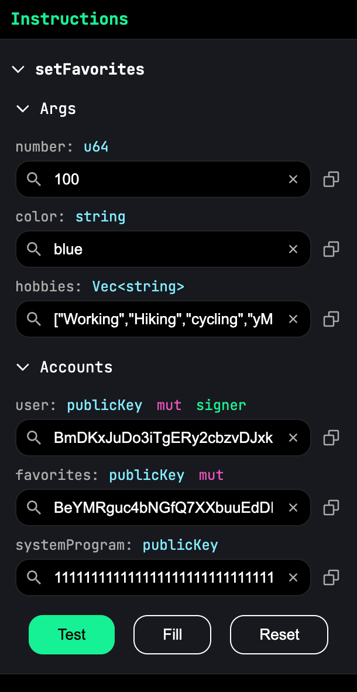

# Favorites

## What is PDA
PDA (Program Derived Address) is a special type of account address in Solana that is owned and managed by a program, 
rather than being controlled by a user’s private key.

PDAs do not have private keys. Instead, they are derived deterministically using:
1. Seeds (custom input data like a user’s public key or a string)
2. A Solana program ID (the smart contract that “owns” the PDA)
3. A bump (collision avoidance value)

### Using PDA in this program
```rust
#[derive(Accounts)]
pub struct SetFavorites<'info> {
    #[account(mut)]
    pub user: Signer<'info>,

    // 使用 PDA（Program Derived Address）机制，保证每个用户的Favorites 账户有唯一的地址。
    // b"favorites" 是固定前缀，user.key().as_ref() 是用户的公钥。
    // bump：用于 PDA 计算时的防碰撞值。
    #[account(
        init_if_needed, 
        payer = user, 
        space = ANCHOR_DISCRIMINATOR_SIZE + Favorites::INIT_SPACE,
        seeds=[b"favorites", user.key().as_ref()],
    bump)]
    pub favorites: Account<'info, Favorites>,

    pub system_program: Program<'info, System>,
}
```

## Explanation Code

### declare_id
```rust
declare_id!("11111111111111111111111111111111");
```
Solana Playground automatically updates this address when you build the program in the next step.

### #[program]
```rust
// The attribute annotates a module containing functions that represent the program's instructions.
// 
// Anchor 提供的宏，用于标记合约的主要逻辑模块。
// 任何在 #[program] 标注的 mod 内部的函数都会被视为 Solana 合约的入口点。
#[program]
pub mod favorites {
    use super::*;
    
    pub fn set_favorites(
        // Context<Initialize> 表示该合约方法 依赖于 Initialize 结构体中的账户，Anchor 会自动解析这些账户。 
        context: Context<SetFavorites>,
        number: u64,
        color: String,
        hobbies: Vec<String>,
    ) -> Result<()> {
        let user_public_key = context.accounts.user.key();
        msg!("Greetings from {}", context.program_id);
        msg!("User {user_public_key}'s favorite number is {number}, favorite color is: {color}",);

        msg!("User's hobbies are: {:?}", hobbies);

        context.accounts.favorites.set_inner(Favorites {
            number,
            color,
            hobbies,
        });
        Ok(())
    }
}
```

### #[account]
```rust
#[account]
#[derive(InitSpace)]
pub struct Favorites {
    pub number: u64,

    #[max_len(50)]
    pub color: String,

    #[max_len(5, 50)]
    pub hobbies: Vec<String>,
}
```
1. `#[account]` 是 Anchor 提供的宏，表示这个结构体可以作为 Solana 账户存储数据。
2. `#[derive(InitSpace)]`anchor 自动计算存储 Favorites 结构体所需的空间（避免手动计算）。

## Deploying on Solana Playground
### 1: Get Devnet SOL
[The Web Faucet](https://faucet.solana.com/).

### 2: Build and Deploy Program
open https://beta.solpg.io in a new browser tab.

### 3: Test Program
#### Calculating the seeds
favorites public key:
- seed: "favorites"
- public key: {Current wallet}
- program: {declare_id} 
#### Example


#### Transaction Details
```
solana confirm -v 4GWpffNBUoSyAucNBgdr7XEoaEDKcsoZi1S6CDEAkx1W19Fk2wk6GBaKpukomUmvywngimY51BNHZsh8UX3Mb6eX
```

### 4: Fetch Result
```
[
  {
    "publicKey": "BeYMRguc4bNGfQ7XXbuuEdDFDEHYdNQieZK87Htvfhfz",
    "account": {
      "number": "100",
      "color": "sky gray",
      "hobbies": [
        "Working",
        "Hiking",
        "Cycling",
        "Coding"
      ]
    }
  }
]
```
